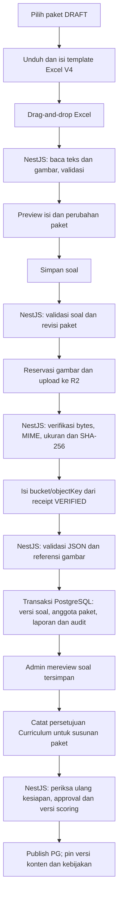

> **ENGINEERING DECISION — 6 October 2026:** the owner-approved [V5 upload-first workflow](UPLOAD_FIRST_WORKFLOW.md) supersedes package-first UI and required source/code fields below. Existing parser contracts remain readable for new copies.

# Upload soal Excel dari portal Admin

**ENGINEERING DECISION — permintaan dan klarifikasi pemilik, 6 Oktober 2026:** input soal baru melalui template Excel yang disediakan. Drag-and-drop dan pemilih file menjalankan parser yang sama. Tampilkan isi/perubahan sebelum satu tombol **Simpan soal**; publikasi tetap tindakan terpisah sesudah review. JSON merupakan format pertukaran internal, bukan tugas konversi manual bagi Admin.

**PRD RULE — v0.6 §3.2–3.3:** Super Admin dan Content/Data/Moderation mengelola konten/assessment. Operations tidak mengimpor, mereview atau menerbitkan soal. Screenshot pemilik mengonfirmasi matriks ini. Guru/Siswa tidak memiliki akses tersebut; browser memakai Supabase hanya untuk autentikasi.

## Pipeline dan penyimpanan

Soal tanpa gambar melewati tahap reservasi/upload. JSON tidak perlu diunduh atau diunggah ulang. Endpoint dan tabel existing dipakai kembali; tidak ditambahkan antrean, bank media kedua, atau tabel Excel tersendiri. XLSX maksimal 10 MiB/100 soal; gambar 5 MiB per gambar/20 MiB total, mengikuti parser existing.

V4 mengikat satu file ke UUID/versi/tujuan/sumber paket. Drill 10 soal untuk subbab/level; Pretest 20 untuk bab; Tryout 30 lintas bab. DRAFT parsial dapat disimpan. Master Curriculum yang tidak ditemukan menghasilkan error; parser tidak menciptakan master atau tingkat kesulitan. Template lama memerlukan pengikatan eksplisit; identitas V4 yang salah tidak dapat dipaksa menjadi paket lain.

**ENGINEERING DECISION:** `metadata.assetManifest[]` pada JSON memakai `assetId`, `placement`, `itemId`, `assetOrder`, `altText`, `bucket`, `objectKey`, `sha256`, `contentType`, dan `byteLength`. Gambar badan soal memakai `placement: "STEM"`; opsi/pembahasan mempunyai posisi masing-masing. Referensi yang disebut pemilik sebagai gambar/cover memakai `objectKey` existing; tidak ditambahkan alias satu gambar yang kehilangan posisi gambar lainnya.

Gambar disimpan di R2. PostgreSQL menyimpan metadata/referensi pada `question_versions.media` dan konten JSON versi soal, bukan base64. Key final memakai identitas aset dan hash sehingga revisi gambar tidak menimpa gambar historis. Signed PUT hanya untuk key sementara; backend memverifikasi byte lalu menulis key final. Signed GET untuk preview diberikan setelah otorisasi dan tidak menjadi referensi permanen. Rujukan: [presigned URLs](https://developers.cloudflare.com/r2/api/s3/presigned-urls/) dan [CORS browser](https://developers.cloudflare.com/r2/buckets/cors/).

## Kegagalan dan retry

- Salah format/binding/sel/master atau revisi paket: tampilkan laporan; jangan unggah gambar/simpan soal sebelum validasi awal lolos.
- Upload/receipt R2 gagal: jangan commit soal/paket. Retry Simpan memakai kembali receipt verified.
- Commit API timeout: pertahankan body dan Idempotency-Key yang sama; retry langsung ke importer. Preflight ulang dapat salah menolak operasi yang sudah berhasil karena revisi paket berubah.
- Transaksi database gagal: versi soal, anggota paket, laporan dan audit rollback bersama. R2/PostgreSQL tidak mempunyai transaksi bersama; media verified dapat tertinggal dan dipakai ulang. Jangan menghapus media final yang direferensikan histori.
- Paket terbit tidak ditimpa; buat versi baru. Edit/seleksi/file baru adalah operasi baru. Dua operasi Simpan tidak berjalan bersamaan dalam halaman.

## Review dan batas Publish

Review existing merekam user Admin, waktu dan catatan untuk versi soal dalam paket DRAFT. Review bukan scoring dan tidak memberi XP. UI membedakan tersimpan, ditinjau, dan dapat diterbitkan.

Admin dapat mencatat review seluruh paket dalam satu tindakan setelah memeriksa isinya. Isi referensi persetujuan dan konfirmasi, lalu **Catat persetujuan paket**. **Publish paket** mempromosikan versi soal ke READY dan paket ke PUBLISHED dalam satu transaksi. Drill memakai satu paket resmi aktif per level; arsipkan paket lama sebelum menerbitkan penggantinya. Tryout memerlukan tanggal rilis Senin 00:00 WIB mendatang; hanya satu paket per minggu. Durasi tetap 600 detik dan batch tutup Minggu 23:59:00 WIB, mengikuti lifecycle existing dan klarifikasi pemilik; Admin tidak mengubahnya. Pretest memakai aturan penempatan PRD existing. **Arsipkan paket** mempertahankan versi soal dan seluruh attempt/histori.

API Admin memakai `POST /api/v1/admin/content/packages/:id/approval` (`expectedRevision`, `reference`, `confirmed: true`), `/publish` (`expectedRevision`, serta `releaseAt` untuk Tryout), dan `/archive` (`expectedRevision`). Guard yang sama membatasi semuanya ke Super Admin/Content. Persetujuan dan Publish memeriksa versi/revisi tersimpan; konflik menghasilkan 409. Publish/arsip ulang terhadap status yang sudah tercapai mengembalikan paket yang sama.

Siswa memuat gambar versi attempt melalui `GET /api/v1/assessment-items/:instanceId/media?phase=WORK|REVIEW`. Backend memeriksa kepemilikan attempt; gambar pembahasan tidak diberikan saat pengerjaan. Review Tryout tetap mengikuti gate rilis hasil/IRT existing. Signed URL dapat diperbarui saat kedaluwarsa.

**ENGINEERING DECISION / klarifikasi pemilik:** materi, blueprint/distribusi, kesulitan, kunci dan pembahasan sudah disetujui dan menurut pemilik tersedia pada Admin. Pernyataan ini dicatat; persetujuan tidak diasumsikan sebagai angka rubrik atau konfigurasi yang belum tersimpan.

**ENGINEERING DECISION — klarifikasi lanjutan pemilik:** Admin Content boleh mencatat persetujuan Curriculum terhadap susunan paket di halaman paket. Simpan referensi persetujuan, distribusi aktual, pin versi soal/scoring dan digest; perubahan komposisi membatalkan kecocokan persetujuan. Publish harus memeriksa ulang data tersimpan dalam transaksi yang sama. Tidak mengisi distribusi atau nilai akademik secara otomatis dari asumsi.

**OPEN:** angka rubrik parsial PGK belum tersedia. PGK tetap dapat disimpan dan ditinjau; publikasi runtime bernilai dibatasi pada PG sampai aturan scoring PGK disetujui dan diimplementasikan.

## Konfigurasi dan verifikasi

**ENGINEERING VERIFICATION:** konfigurasi R2 yang diberikan pemilik sudah dipasang pada `.env` lokal yang diabaikan Git; `CONTENT_IMPORT_PREVIEW_ENABLED=true` dan `R2_MEDIA_UPLOADS_ENABLED=true`. Bucket nyata `numora-bucket` dapat diakses. CORS bucket diperbaiki untuk GET/HEAD/PUT dan header Content-Type/Content-Length pada dua origin development dalam environment; origin deployment perlu mengikuti URL portal deployment.

Isi pada environment API yang benar: `R2_ACCOUNT_ID`, `R2_ACCESS_KEY_ID`, `R2_SECRET_ACCESS_KEY`, `R2_BUCKET` dan `R2_MEDIA_UPLOADS_ENABLED=true`. Prefix/TTL menggunakan default existing. CORS harus mengizinkan origin portal dan PUT/Content-Type; [contoh repo](../operations/r2-cors.example.json) hanya memuat localhost:3000. Lifecycle sementara boleh dibatasi pada `question-media/_pending/`; jangan membersihkan semua media soal.

QA memeriksa drop/pemilih file, salah format/jumlah file, tiga tujuan paket, posisi gambar, gagal upload/retry, receipt/conflict, retry setelah commit timeout, pemisahan role dan review histori. Smoke nyata pada project development `pkamenfnwmoeisccnrnk` membuktikan autentikasi Admin, Excel bergambar, PUT browser/CORS, verifikasi server, commit PostgreSQL, replay idempotent, review, persetujuan dan Publish. Paket **DEMO — Excel R2 smoke 6 Oktober 2026**, UUID `65fe3589-b810-4a91-be83-8879fc1ff5f6`, berisi 10 PG sintetis dan berstatus PUBLISHED. Autentikasi siswa nyata, akses media milik attempt dan GET R2 berhasil; attempt uji diakhiri CANCELLED tanpa XP/progress. Paket/konten akademik existing tidak ditimpa.

Migrasi `0031_excel_package_publication.sql` mengizinkan perubahan status/review versi impor dengan konten tetap immutable. Migrasi telah diterapkan pada database development tersebut. Runner migrasi menangani hash exact yang sebelumnya tercatat pada cursor cabang lebih lama dengan menambahkan cursor canonical, mempertahankan seluruh rekaman histori asli. Regresi migrasi, transaksi publikasi, otorisasi media, stale approval dan arsip diuji pada PostgreSQL lokal terisolasi; E2E browser memakai API mock, terpisah dari smoke cloud nyata. Build aplikasi bukan deployment.
