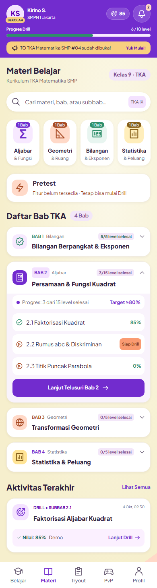
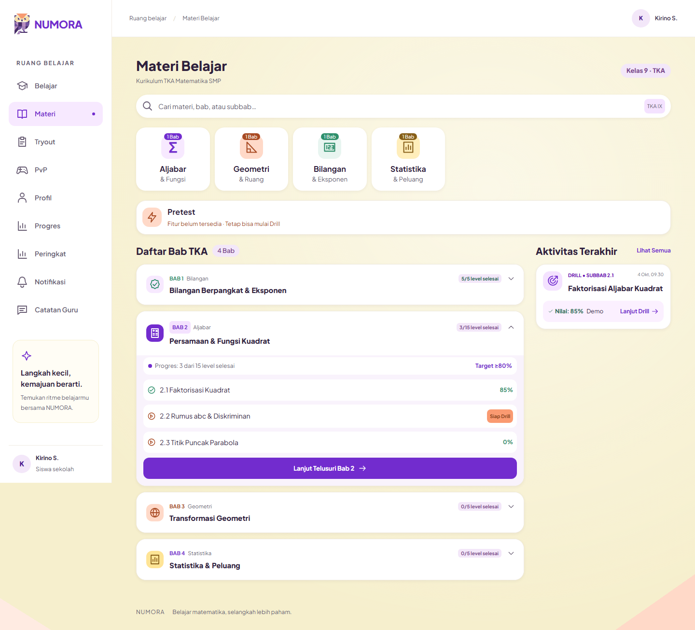

# Materi Belajar dan Pusat Notifikasi — implementation handoff

**ENGINEERING DECISION — 5 October 2026:** follows the owner-approved [Materials/Notifications scope](../product/MATERIALS_NOTIFICATIONS_2026-10-04.md) and the latest attached Materi mobile screenshot. This is a screenshot-based implementation, not a claim that the entire Figma document was accessible.

## Screens and visual changes

- `/student/learn`: actual Student identity header, paper/ivory background with peach corners, heading, search with TKA IX tag, four white category cards, mint Bilangan icon, peach Pretest information card, chapter accordion, lavender expanded body, subchapter rows, purple continuation CTA and recent activity. Mobile bottom navigation selects Materi.
- One chapter expands at a time. Search, category and chapter are encoded in the URL. Old chapter bookmarks redirect to the appropriate open accordion. Subchapter links and roadmap back navigation retain the existing Drill flow.
- `/student/notifications`: purple contextual header, unread count, six pill filters, Jakarta date groups, colored event icons, explicit per-item/read-all actions, pagination and typed destination/command actions.
- Admin taxonomy adds explicit nullable chapter categories. The Student bell shows the backend unread count and opens Notifications; desktop navigation includes the inbox.
- Existing loading/error/empty/session-expired states remain interactive. Accordion controls are keyboard accessible, titles wrap, and visual tests check body overflow at nine widths.

## Deliberate reference deviations

| Reference | Implemented behavior and reason |
| --- | --- |
| Gems, account XP and Level 9 | Actual identity/Drill progress. The current contract does not provide those account rewards. |
| Curriculum dropdown | Static Kelas 9 · TKA context; no unsupported selector. |
| Search formulas/question contents | Searches chapter and subchapter titles provided by the catalog. |
| Pretest “Skip Level 1–3” | Explains Pretest is unavailable and Drill remains available; no placement behavior is introduced. |
| Chapter “60% Tuntas” / “100% Selesai” | Server counts of completed levels, avoiding a new definition of chapter mastery. |
| Locked next subchapter / unpublished chapter / “Baru” | Subchapters remain independently accessible; unpublished content is hidden and no unsupported new-content badge appears. |
| Selected sample scores and chapter counts | Actual API values, including score zero and null. Visual fixtures are explicitly synthetic. |
| Clipped long chapter titles | Full wrapping titles and minimum touch targets for accessibility. |
| Rank/XP/Pretest notifications | Only the five supported events; no invented ranking rewards or Pretest triggers. |
| Teacher/PvP sample text and avatar | Actual event data and existing account avatar/initial fallback. |

## Functionality preserved

NestJS remains the authorization/data authority. Drill 80% unlocking, scoring, attempt lifecycle, Tryout Mandiri access/distribution/IRT gating, PvP production policy and acknowledgement retry remain unchanged. Notification reads are independent of Feedback Guru reads. Account-owned query caches are reset by the existing Student session boundary.

Feedback, invitation and first unlock produce notification outbox rows transactionally. Tryout discovery shares the existing API predicates. Worker delivery uses locks, deduplication and durable fan-out cursors; archive is a 30-day query boundary without deletion. No shared Supabase schema or production seed was changed.

## Changed file groups

| Area | Main files |
| --- | --- |
| Materials UI | `apps/web/src/features/core-learning/materials.tsx`, `catalog.tsx`, `apps/web/src/app/numora.css`, `packages/ui/src/icon.tsx` |
| Materials API | `apps/api/src/modules/learning/materials.dto.ts`, `materials.service.ts`, learning controller/module |
| Category editor | Content DTO/service, Admin content UI/API, `packages/database/src/schema/content.ts`, guarded redesign seed |
| Inbox UI | Notification route, `notifications.tsx`, `notification-queries.ts`, date helper, Student header/shell, feedback deep-link support |
| Notification API/worker | `apps/api/src/modules/notifications/`, source services, `apps/worker/src/notifications.ts`, worker runtime |
| Persistence/contracts | Migration `0024_materials_notifications.sql`, snapshot/journal, notification schema/events, shared Tryout visibility, OpenAPI/generated types |
| Verification | API integration tests, browser materials/notifications/admin/student tests, date tests, worker runtime test, gallery and rollout runbook |

## Verification

| Check | Result |
| --- | --- |
| Workspace lint | Passed; zero warnings |
| Workspace typecheck | 14/14 tasks passed, serial execution |
| API unit/integration | 137 passed; 7 Redis-dependent tests skipped |
| Web unit tests | 190 passed |
| Database tests | 24 passed |
| Worker tests with local PostgreSQL | 15 passed |
| Browser regression | 167 passed; zero skipped, failed or flaky; Student/Mandiri/School, Teacher, Admin, auth and PvP fixtures |
| Script checks | 57 passed |
| Migration / schema | Forward migration through 0024 passed; 106 tables/columns and RLS verified |
| Legacy upgrade | Completed/active attempts, answers and pinned content versions preserved |
| Contracts | Eight schemas valid; OpenAPI regenerated; generated learning/PvP types fresh |
| Web production build | Passed with webpack and optional low-memory mode |
| Final Drill smoke | Two browser tests passed after the final rebuild: retry/new attempt and failed-save recovery |

Browser identity/API fixtures and local Socket.IO transport are synthetic; database integration uses isolated local PostgreSQL. Browser verification uses an ignored temporary copy of the existing specs with origin 3310 instead of 3300 and adjusted relative imports, because a concurrent team run owns port 3300. Assertions and fixtures are otherwise unchanged. Connected Google OAuth, R2 credentials, Redis transport and shared deployment remain environment-dependent release checks.

The API database run uses one worker, a 30-second test timeout and 60-second hook timeout on the shared Windows development machine. The seven skipped API tests require isolated Redis (PvP transport/rate limit and scientific-consumer queue recovery); they are not counted as passes. No production policy is activated by any fixture.

## Review and deployment

Use the [rollout runbook](../development/MATERIALS_NOTIFICATIONS_RUNBOOK.md) to apply migration 0024 through the team workflow before deploying API/worker/web. No manual dashboard schema changes. Team review and merge are required; no automatic merge is performed.

[All mobile/tablet/desktop screenshots](screenshots/materials-notifications/README.md). Baseline 390 px:

